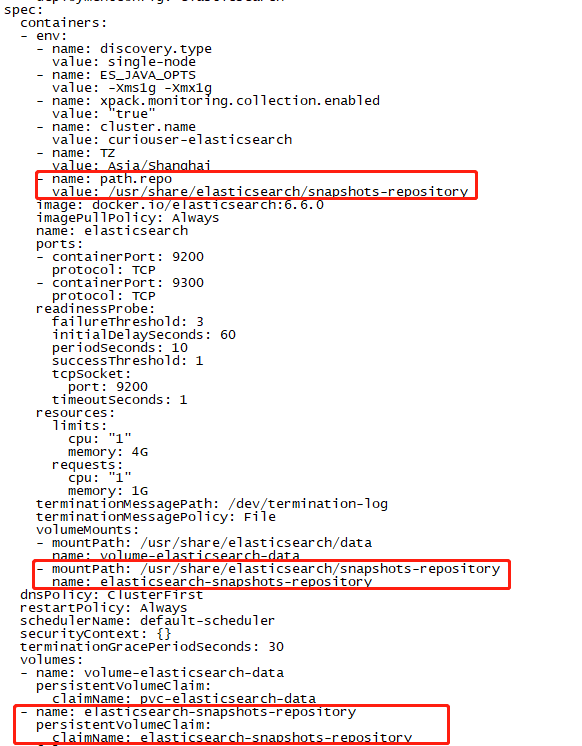
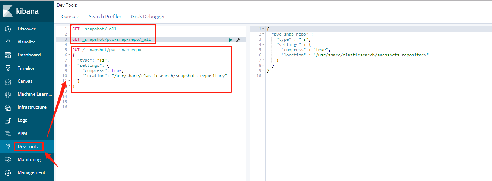

### OKD CronJob to backup elasticsearch index to repository

## 一. elasticsearch in OKD use PV as snapshots repository 

1. Create repository pvc to mount on all elasticsearch node path: "/usr/share/elasticsearch/snapshots-repository"

   

2. Add System environment variable "path.repo=/usr/share/elasticsearch/snapshots-repository" to all elasticsearch node, and reboot elasticsearch

3. Create a snapshots repository by kibana dev tool or command curl

   ```shell
   # Kinana Dev Tool
   PUT /_snapshot/pvc-snap-repo
   {
     "type": "fs",
     "settings": {
       "compress": true,
       "location": "/usr/share/elasticsearch/snapshots-repository"
     }
   }
   # Command Curl
   curl -XPUT "http://elasticsearch.kelk.svc:9200/_snapshot/pvc-snap-repo" -H 'Content-Type: application/json' -d'
   {
     "type": "fs",
     "settings": {
       "compress": true,
       "location": "/usr/share/elasticsearch/snapshots-repository"
     }
   }'
   ```



## 二. Create a OKD Cronjob which use the image include a script to back up  the index created time more than 2 days (not including index which beginning with ". ", it mean dont backup system index)  to the "pvc-snap-repo" snapshots repository , the cronjob will start to run at 01:00 every day

   ```shell
   oc create -f OKD-Backup-ES-Index-Scripts-CronJob.yaml 
   
   oc get cj
   ```

### 附录1:Elasticsearch 常用API(Kibana Dev Tool)

1. 查看API end point参数

   ```json
   GET _cat/indices?help
   ```

2. Index索引

   ```json
   #带表头(默认几个列)
   GET _cat/indices?v
   
   #只输出指定列(只输出index和创建时间戳)(带表头)
   GET _cat/indices?v&h=i,cd
   
   #只输出指定列(只输出index和创建时间戳)(不带表头)
   GET _cat/indices?h=i,cd
   
   #指定列排序输出指定列
   GET _cat/indices?h=i,cd&s=i:desc
   ```

3. snapshot仓库

   ```json
   #创建snapshot仓库
   PUT /_snapshot/snapshots仓库名
   {
     "type": "fs",
     "settings": {
       "compress": true,
       "location": "/usr/share/elasticsearch/snapshot-repository"
     }
   }
   
   #创建基于HDFS后端存储类型的snapshot仓库（所有elasticsearch节点需要安装repository-hdfs插件）
   PUT _snapshot/快照仓库名
   {
     "type": "hdfs",
     "settings": {
       "uri": "hdfs://172.16.3.10:9000",
       "compress": true,
       "path": "elasticsearch/respositories"
     }
   }
   
   # 查看所有的快照仓库
   GET _snapshot/_all
   
   # 删除快照仓库
   DELETE /_snapshot/snapshot仓库
   ```

4. snapshot

   ```json
   # 创建包含所有Index的全量快照
   PUT /_snapshot/my_backup/snapshot_1?wait_for_completion=true
   
   #创建只包含某个索引的快照
   PUT /_snapshot/snapshot仓库/快照名?wait_for_completion=true
   {
     "indices": "index-A,index-B",
     "ignore_unavailable": true,
     "include_global_state": false
   }
   
   #查看仓库中所有的快照
   GET _snapshot/snapshot仓库/_all
   
   #恢复一个快照
   POST _snapshot/snapshot仓库/快照名/_restore
   
   #删除一个快照
DELETE _snapshot/snapshot仓库/快照名
   
   #查看多个快照的状态
   GET _snapshot/snapshot仓库/快照名/_status
   ```
   
   